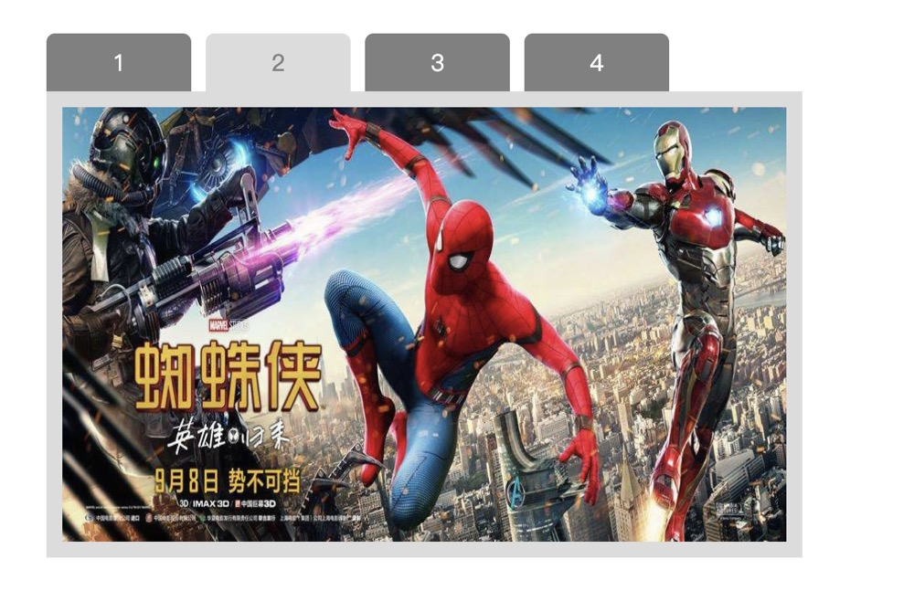

# tabBar
轮播切换

##效果图


##配置
```
    new TabBar({
        tabEle:'.js-tab',//tab包裹层,默认.js-tab
        triggerType: 'mouseover',//事件类型,默认mouseover
        invoke: 0,//默认第几张,0开始,默认0
        auto: 2000,//间隔时间,默认false
    });
```
